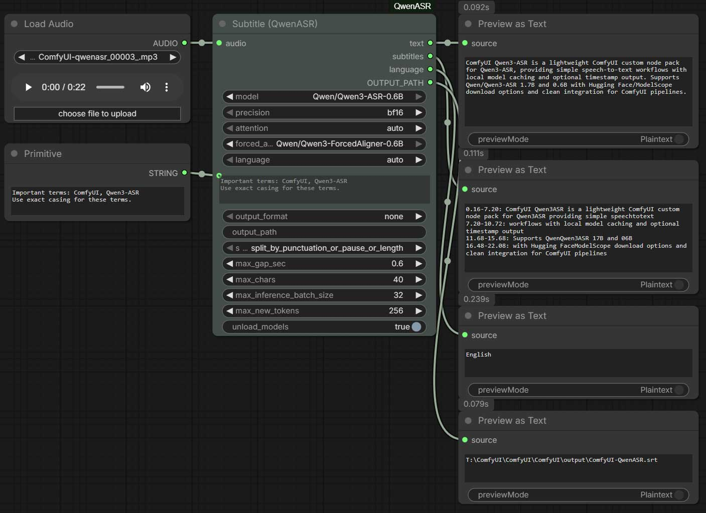

# ComfyUI-QwenASR

ComfyUI custom nodes for **Qwen3-ASR** (Automatic Speech Recognition). This pack focuses on simple, reliable speech-to-text and subtitle workflows with local model caching and long-audio support.


## Features

https://github.com/user-attachments/assets/70d05cb2-9653-448a-ad6f-16868996b61e

- **Two nodes**: simple STT and subtitle generation
- **Long audio handling** (automatic chunking)
- **Forced aligner** for timestamp-accurate subtitles
- **Local model cache** under `ComfyUI/models/Qwen3-ASR/`
- **HuggingFace / ModelScope** download options

## Nodes

### ASR (QwenASR)
- **Input**: AUDIO
- **Output**: text
- **Use case**: quick speech-to-text
 - **Hints**: optional keywords/names to improve recognition

 [Workflow](example_workflows/ASR.json)

### Subtitle (QwenASR)
- **Input**: AUDIO
- **Output**: text, subtitles, language, OUTPUT_PATH
- **Use case**: subtitle generation with timestamps
- **Advanced options**: forced aligner, max batch size, max new tokens
 - **Hints**: optional keywords/names to improve recognition
- **Output format**: none / txt / srt (controls file save only)
- **Output path**: optional file save location (default: `ComfyUI/output/ComfyUI-QwenASR/`)
 - **Split mode**: default is punctuation + pause + length (balanced for subtitles)

 [Workflow](example_workflows/Subtitle.json)

Tip: in ComfyUI search, type **ASR** to find these nodes quickly.

## Installation

1) Install the custom node:
```
cd ComfyUI/custom_nodes

git clone https://github.com/1038lab/ComfyUI-QwenASR.git
```

2) Install dependencies:
```
cd ComfyUI/custom_nodes/ComfyUI-QwenASR

pip install -r requirements.txt
```

3) Restart ComfyUI.

## Models

Supported:
- `Qwen/Qwen3-ASR-1.7B`
- `Qwen/Qwen3-ASR-0.6B`
- `Qwen/Qwen3-ForcedAligner-0.6B` (for subtitles)

Downloaded models are stored in:
```
ComfyUI/models/Qwen3-ASR/
```

### config.json (defaults & model list)

You can edit `config.json` in the repo root to change defaults (e.g. default model, source)
or to add/remove model repo entries.

Example:
```
{
  "defaults": {
    "source": "ModelScope",
    "repo_id": "Qwen/Qwen3-ASR-0.6B"
  }
}
```

Tip: If you are in mainland China, using **ModelScope** as the source is usually faster and more reliable.

### Custom model locations (extra_model_paths.yaml)

If you keep models outside the default folder, add the parent directory to ComfyUI’s `extra_model_paths.yaml`.
This node will also search those paths for `Qwen3-ASR` models.

## Usage

**STT**
```
LoadAudio → ASR (QwenASR) → ShowText
```

**Subtitles**
```
LoadAudio → Subtitle (QwenASR) → ShowText / SaveText
```

## Notes

- Long audio is automatically chunked inside the model pipeline.
- Subtitle timestamps require the forced aligner to be available.
- If you switch machines or want manual control, use `local_model_path`.

## License

- Code: GPL-3.0
- Models: Qwen3-ASR (Apache-2.0)
